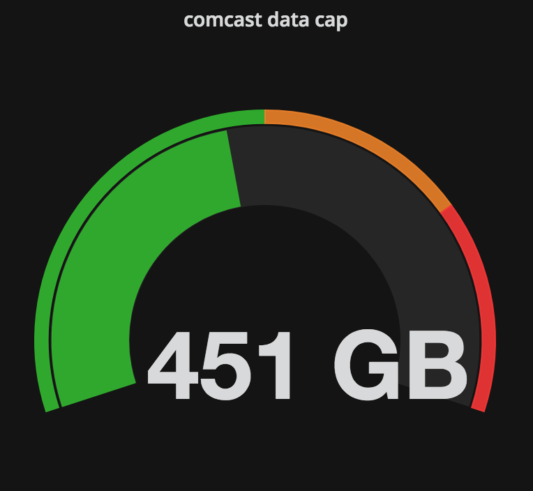

**Comcast Data Cap Usage Collector For InfluxDB and Grafana**
------------------------------



This tool allows you to run periodic comcast data usage checks and save the results to Influxdb

## Configuration within config.ini

#### GENERAL
|Key            |Description                                                                                                         |
|:--------------|:-------------------------------------------------------------------------------------------------------------------|
|Delay          |Delay between runs                                                                                                  |
|Output         |Write console output while tool is running                                                                          |
#### INFLUXDB
|Key            |Description                                                                                                         |
|:--------------|:-------------------------------------------------------------------------------------------------------------------|
|Address        |Delay between updating metrics                                                                                      |
|Port           |InfluxDB port to connect to.  8086 in most cases                                                                    |
|Database       |Database to write collected stats to                                                                                |
|Username       |User that has access to the database                                                                                |
|Password       |Password for above user                                                                                             |
#### COMCAST
|Key            |Description                                                                                                         |
|:--------------|:-------------------------------------------------------------------------------------------------------------------|
|Username       |Comcast username (don't include the @comcast.com)                                                                   |
|Password       |Password for above user  


## InfluxDB metrics
```
'measurement': 'comcast_data_usage',
'fields': {
		'used': self.used,
		'total': self.total,
		'unit': self.unit
}
```

## Grafana singlestat example
See this [example json](example.json) for a singlestat panel as shown in the screenshot above

**Usage**

Before the first use run pip3 install -r requirements.txt

Enter your desired information in config.ini and run InfluxdbComcast.py

Optionally, you can specify the --config argument to load the config file from a different location.  


***Requirements***

Python 3+

You will need the influxdb library installed to use this - [Found Here](https://github.com/influxdata/influxdb-python)

## Docker Setup

1. Install [Docker](https://www.docker.com/)

2. Make a directory to hold the config.ini file. Navigate to that directory and download the sample config.ini in this repo.
```bash
mkdir comcastUsage-for-influxdb
curl -O https://raw.githubusercontent.com/billimek/comcastUsage-for-influxdb/blob/master/config.ini comcastUsage-for-influxdb/config.ini
cd comcastUsage-for-influxdb
```

3. Modify the config file with your influxdb settings.
```bash
vim config.ini
```
Modify the 'Address =' line include the ip or hostname of your influxdb instance.
Example:
```bash
Address = 10.13.14.200
```

Modify the 'Username' and 'Password' in the _COMCAST_ section with your comcast login credentials.  *NOTE* you only need the username portion of your comcast login, not the @comcast.com part
Example:
```
[COMCAST]
Username = annoying_customer
Password = supersecretpassword
```

4. Run the container, pointing to the directory with the config file. This should now pull the image from Docker hub.
```bash
docker run -d \
--name="comcast" \
-v config.ini:/src/config.ini \
--restart="always" \
billimek/comcastusage-for-influxdb
```
